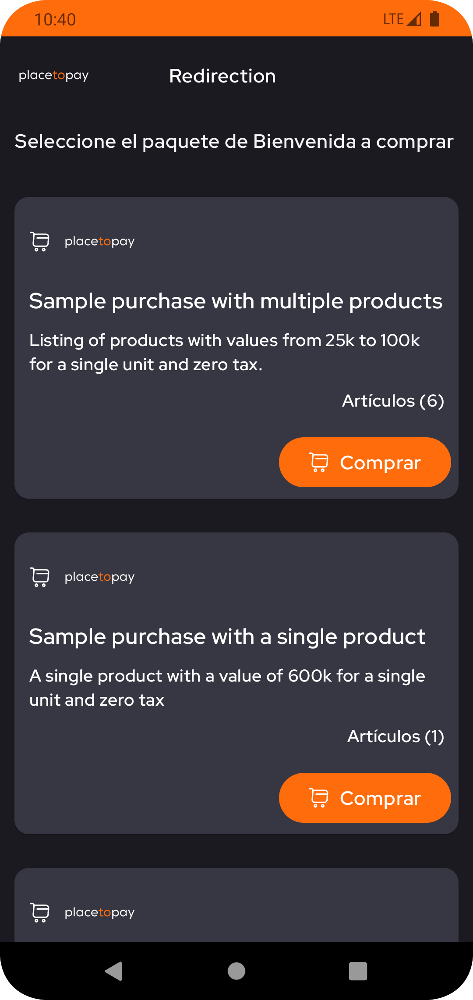
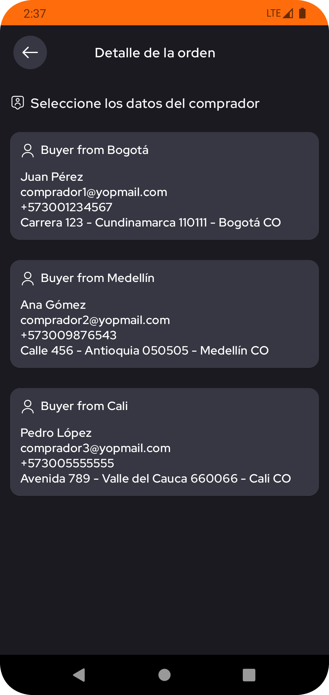
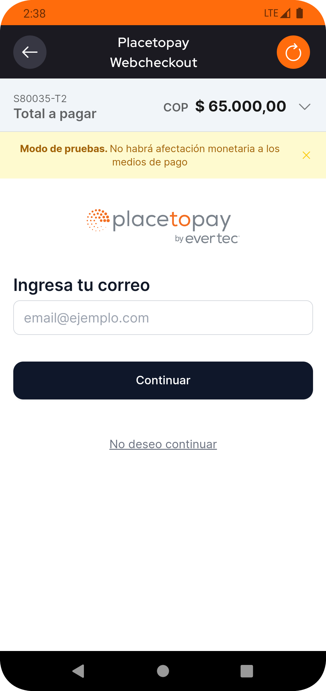

# PlacetoPay Redirection


Con este ejemplo podrá conectarse rápidamente con los servicios de pago de PlacetoPay.

Para ver ejemplos más completos de cómo funciona, consulte los ejemplos y
la [documentación](https://docs.placetopay.dev/checkout).

***

## Tabla de contenido

### Integrando Checkout

- [Autenticación](#autenticación)
    - [Requerimientos](#requerimientos)
    - [Como generar la autenticación](#como-generar-la-autenticación)
- [Configuración de servicios con Retrofit](#configuración-de-servicios-con-retrofit)
- [Crear una sesión de pago](#crear-una-sesión-de-pago)
- [Consultar una sesión](#consultar-una-sesión)
- [Configurar la WebView](#configurar-la-webview)

### App de prueba

- [Prueba los credenciales](#prueba-los-credenciales)
- [Preview](#preview)
- [Librerías](#librerías)
- [Glosario](#glosario)

### Versión
- [Inglés](README.md)

***

## Autenticación

El parámetro de __auth__ debe enviarse en __todas las solicitudes del API__ y contiene el conjunto de propiedades necesarias para verificar la autenticación.

### Requerimientos

> Para integrarse con Checkout, debe tener sus credenciales de `login` y `secretKey`.

- `login`: El identificador del sitio puede considerarse público ya que viaja como datos simples en las solicitudes de API.
- `secretKey`: Clave secreta del sitio, debe ser privada, a partir de este dato se generará una nueva `tranKey` que será
  enviado en las solicitudes.

> Estas credenciales son exclusivas de su sitio y deben tratarse de forma segura.
>
> No comparta sus credenciales en lugares de acceso público como Github, código del lado del cliente u otros lugares con acceso fácil de terceros.

### [Como generar la autenticación](https://docs.placetopay.dev/en/checkout/authentication#how-to-generate-your-authentication)

Debes preparar la siguiente información:

| Parámetro   | Descripción                                                                                                                                                                          |
|:------------|:-------------------------------------------------------------------------------------------------------------------------------------------------------------------------------------|
| `login`     | Identificador del sitio, credencial proporcionado al iniciar su integración.                                                                                                         |
| `secretKey` | Clave secreta del sitio, credencial proporcionada al iniciar su integración.                                                                                                         |
| `seed`      | Esta es la fecha en que se generó la autenticación. La fecha debe estar en formato ISO 8601.                                                                                         |
| `nonce`     | Cadena de texto aleatorio que identifica una solicitud como única. Se genera y se utiliza para crear `tranKey` sin codificación base64. Al enviarlo debe estar codificado en base64. |
| `tranKey`   | Generado en cada solicitud. Se genera con las siguiente fórmula Base64(SHA-256(nonce + seed + secretKey)).                                                                           |

> Para este ejemplo, se está utilizando un entorno de Colombia.
> Para obtener más información, consulte los [directorios de entornos](https://docs.placetopay.dev/en/checkout/test-your-integration#directory-of-environments)

***

La clase de ejemplo `CheckoutAuth` se utiliza como parámetro de la solicitud en operaciones de autenticación.
La clase incluye métodos privados para cálculos criptográficos, garantizando la seguridad y confidencialidad de los
autenticación.

``` kotlin
data class CheckoutAuth(
    val login: String,
    @Expose(serialize = false)
    private val secretKey: String
) {
    private var nonce: String
    private var seed: String
    private var tranKey: String

    init {
        requireNotNull(login.isNotEmpty()) { "No login provided on authentication" }
        requireNotNull(secretKey.isNotEmpty()) { "No tranKey provided on authentication" }
        val nonceTemp = secureRandom()
        seed = dateInISO()
        tranKey = toBase64(toSHA256(nonceTemp + seed + secretKey))
        nonce = toBase64(nonceTemp.encodeToByteArray())
    }

    private fun secureRandom(): String = BigInteger(130, SecureRandom()).toString()

    private fun dateInISO(): String =
        SimpleDateFormat("yyyy-MM-dd'T'HH:mmZ", Locale.getDefault()).apply {
            timeZone = TimeZone.getTimeZone("America/Bogota")
        }.format(Calendar.getInstance().time)

    private fun toBase64(input: ByteArray): String {
        val encodedBytes: ByteArray =
            if (Build.VERSION.SDK_INT >= Build.VERSION_CODES.O)
                Base64.getEncoder().encode(input)
            else android.util.Base64.encode(input, android.util.Base64.NO_WRAP)

        return String(encodedBytes)
    }

    private fun toSHA256(input: String): ByteArray =
        MessageDigest.getInstance("SHA-256").digest(input.toByteArray())
}
```

`CheckoutAuth` como parámetro en el cuerpo de la solicitud en JSON.

``` json
{
    "login": "c51ce410c124a10e0db5e4b97fc2af39",
    "tranKey": "VQOcRcVH2DfL6Y4B4SaK6yhoH/VOUveZ3xT16OQnvxE=",
    "nonce": "NjE0OWVkODgwYjNhNw==",
    "seed": "2023-10-17T16:22-0500"
}
```

> Errores frecuentes, consulte los [posibles errores](https://docs.placetopay.dev/en/checkout/authentication#possible-errors).

***

### Configuración de servicios con Retrofit

Cree el service interface con Retrofit para los endpoints de [`Create Session`](#crear-una-sesión-de-pago)
y [`Query Session`](#consultar-una-sesión).

> La instancia de Retrofit debe tener como `baseUrl` el [entorno](https://docs.placetopay.dev/en/checkout/test-your-integration#directory-of-environments) acorde a la versión de la app. 
> 
> Los parámetros con **@Body** deben contener el parámetro auth de tipo `CheckoutAuth` o el data class responsable de la autenticación.

``` kotlin
interface CheckoutService {

    @POST("/api/session")
    suspend fun createSession(
        @Body payment: CheckoutPaymentRequest,
    ): Response<CheckoutPaymentResponse>

    @POST("/api/session/{requestId}")
    suspend fun informationSession(
        @Path("requestId") requestId: String,
        @Body payment: CheckoutInformationRequest,
    ): Response<CheckoutInformationResponse>
    
    ...
}
```

***

### [Crear una sesión de pago](https://docs.placetopay.dev/en/checkout/api-reference/session#create-a-session)

Creando una nueva solicitud de pago para obtener una URL de pago de la sesión.

Simplemente proporcione la información del pago necesario y obtendrá una URL del proceso si se realiza correctamente. Para este ejemplo,
están utilizando la **Información básica** que debe proporcionarse; para ver la estructura completa, consulte
la [documentación](https://docs.placetopay.dev/en/checkout/create-session).

La clase de ejemplo `CheckoutPaymentRequest` se utiliza como cuerpo de solicitud. La clase incluye el pago, comprador, envío.
y otra información.

``` kotlin
data class CheckoutPaymentRequest(
    val auth: CheckoutAuth,
    val buyer: CheckoutBuyer? = null,
    val cancelUrl: String,
    val captureAddress: Boolean = false,
    val expiration: String,
    val fields: List<CheckoutField>? = null,
    val locale: String,
    val noBuyerFill: Boolean = false,
    val payment: CheckoutPayment,
    val returnUrl: String,
    val ipAddress: String,
    val skipResult: Boolean = false,
    val userAgent: String
)
```

`CheckoutPaymentRequest` como parámetro en el cuerpo de la solicitud en JSON.

> Consulte [el pago básico completo](examples/basic_payment_reques.json)

``` json
{
  "auth": {
    "login": "c51ce410c124a10e0db5e4b97fc2af39",
    ...
  },
  "expiration": "2023-10-17T23:13-0500",
  "locale": "es_CO",
  "payment": {
    "amount": {
      "currency": "COP",
      "details": [
        {
          "amount": 150000.0,
          "kind": "subtotal"
        },
        ...
      ],
      "total": 165000.0,
      ...
    },
    "buyer": {
      ...
    },
    "items": [
      {
        "category": "Books",
        "name": "Libro antiguo",
        "price": 80000,
        "qty": 1,
        "sku": 302,
        "tax": 15200.0
      },
      ...
    ],
    "reference": "3"
  },
  "returnUrl": "redirection://receipt?return",
  "userAgent": "Mozilla/5.0 (X11; Linux x86_64) Chrome/52.0.2743.116 Safari/537.36 ...",
  ...
}
```

La clase de ejemplo `CheckoutPaymentResponse` se utiliza como cuerpo de respuesta. La clase incluye el estado, la identificación de la solicitud y la URL de pago.

``` kotlin
data class CheckoutPaymentResponse(
    val status: CheckoutStatus,
    val requestId: String,
    val processUrl: String,
)
```

`CheckoutPaymentResponse` como parámetro en el cuerpo de la solicitud en JSON.

``` json
{
  "status": {
    "status": "OK",
    "reason": "PC",
    "message": "La petición se ha procesado correctamente",
    "date": "2023-10-18T15:02:20-05:00"
  },
  "requestId": 2630139,
  "processUrl": "https://checkout-test.placetopay.com/spa/session/2630139/7149a8cf3..."
}
```

---

### [Consultar una sesión](https://docs.placetopay.dev/en/checkout/api-reference/session#query-a-session)

Este endpoint le permite obtener la información de la sesión, si hay transacciones en la sesión, los detalles
de los mismos se muestran.

La clase de ejemplo `CheckoutInformationRequest` se utiliza como cuerpo de la solicitud. La clase incluye información de la autenticación.

``` kotlin
data class CheckoutInformationRequest(
    val auth: CheckoutAuth,
)
```

`CheckoutInformationRequest` como parámetro en el cuerpo de la solicitud en JSON.

``` json
{
  "auth": {
    "login": "c51ce410c124a10e0db5e4b97fc2af39",
    "nonce": "NjE0OWVkODgwYjNhNw==",
    "seed": "2023-10-17T17:13-0500",
    "tranKey": "VQOcRcVH2DfL6Y4B4SaK6yhoH/VOUveZ3xT16OQnvxE="
  }
}
```

La clase de ejemplo `CheckoutInformationResponse` se utiliza como cuerpo de la respuesta. La clase incluye el estado, la identificación de la solicitud.
e información de pago.

``` kotlin
data class CheckoutInformationResponse(
    val status: CheckoutStatus,
    val requestId: String,
    val request: CheckoutPaymentRequest,
    ...
)
```

`CheckoutInformationResponse`  como parámetro en el cuerpo de la solicitud en JSON.

>  Consulte [la respuesta de completa](examples/information_response.json)

``` json
{
  "requestId": 2630139,
  "status": {
    "status": "APPROVED",
    "reason": "00",
    "message": "La petición ha sido aprobada exitosamente",
    "date": "2023-10-18T15:02:42-05:00"
  },
  "request": {
    "locale": "es_CO",
    "payer": {
      "document": "1040035001",
      ...
    },
    "payment": {
      "reference": "2",
      "amount": {
        "details": [
          {
            "kind": "shipping",
            "amount": 15000
          },
          ...
        ],
        "currency": "COP",
        "total": 65000
      },
      "items": [
        ...
      ],
      ...
    },
    "fields": [
      {
        "keyword": "_processUrl_",
        "value": "https://checkout-test.placetopay.com/spa/session/2630139/7149...",
        "displayOn": "none"
      },
      ...
    ],
    "returnUrl": "redirection://receipt?return",
    "userAgent": "Mozilla/5.0 (X11; Linux x86_64) Chrome/52.0.2743.116 Safari/537.36 ...",
    ...
  },
  "payment": [
    {
      "amount": {
        ...
      },
      "status": {
        "date": "2023-10-18T15:02:39-05:00",
        "status": "APPROVED",
        ...
      },
      "issuerName": "JPMORGAN CHASE BANK, N.A.",
      "paymentMethod": "visa",
      "processorFields": [
        {
          "value": "012988341",
          "keyword": "merchantCode",
          "displayOn": "none"
        },
        ...
      ],
      "paymentMethodName": "Visa",
      ...
    }
  ],
  "subscription": null
}
```

---

### Configurar la WebView

Estas configuraciones ayudan a optimizar y personalizar la experiencia de navegación dentro del WebView.

> Configuración del WebView para una visualización correcta de Checkout

``` kotlin
AndroidView(factory = {
        WebView(it).apply {
            settings.javaScriptEnabled = true
            settings.domStorageEnabled = true
            clearCache(true)
            webChromeClient = WebChromeClient()
            webViewClient = object : WebViewClient() {
                ...
            }
            loadUrl(...)
        }
    }, update = {
        it.loadUrl(...)
        ...
    })
    
```

| Configuración                         | Descripción                                                                                                 |
|:--------------------------------------|:------------------------------------------------------------------------------------------------------------|
| `JavaScriptEnabled`                   | Habilita la ejecución de JavaScript en la página web.                                                       |
| `DomStorageEnabled`                   | Permite que las páginas web almacenen datos localmente, lo que puede mejorar la velocidad y el rendimiento. |
| `ClearCache`                          | Borra la caché de WebView antes de cargar una nueva URL.                                                    |
| `WebChromeClient` and `WebViewClient` | Configura el comportamiento del WebView para eventos como la carga y la interacción con la página.          |

---

## Prueba los credenciales

- Clona este repositorio en tu máquina local.

```
git clone https://github.com/placetopay-org/checkout-android.git
```

- Abrir el proyecto en Android Studio.
- Configurar los credenciales de `login`, `secretKey` y `urlEnvironment` en `/app/src/debug/assets/private.properties`.
- Build y run.

---

## Preview







---

### Librerías

| Librería         | Version                                                |
|:-----------------|:-------------------------------------------------------|
| Compose BOM      | `androidx.compose:compose-bom:2023.03.00`              |
| View Model       | `androidx.lifecycle:lifecycle-viewmodel-compose:2.5.1` |
| Glide            | `com.github.bumptech.glide:compose:1.0.0-alpha.5`      |
| Dagger Hilt      | `com.google.dagger:hilt-android:2.44.2`                |
| Hilt Navigation  | `androidx.hilt:hilt-navigation-compose:1.0.0`          |
| Retrofit         | `com.squareup.retrofit2:retrofit:2.9.0`                |
| Gson Converter   | `com.squareup.retrofit2:converter-gson:2.9.0`          |
| Chucker          | `com.github.chuckerteam.chucker:library:4.0.0`         |

---

### Glosario

| Nombre      | Descripción                                                                                                                        |
|:------------|:-----------------------------------------------------------------------------------------------------------------------------------|
| `login`     | Identificador del sitio, puede considerarse público porque viaja como datos simples en las solicitudes del API.                    |
| `secretKey` | Clave secreta del sitio, debe ser privada, a partir de estos datos se generará una nuevo `tranKey` que se enviará en la solicitud. |
| `tranKey`   | Generado en cada solicitud.                                                                                                        |
| `nonce`     | Cadena de texto aleatorio que identifica una solicitud como única.                                                                 |
| `seed`      | Esta es la fecha en que se generó la autenticación.                                                                                |
| `baseUrl`   | [URL del entorno](https://docs.placetopay.dev/en/checkout/test-your-integration#directory-of-environments).                        |