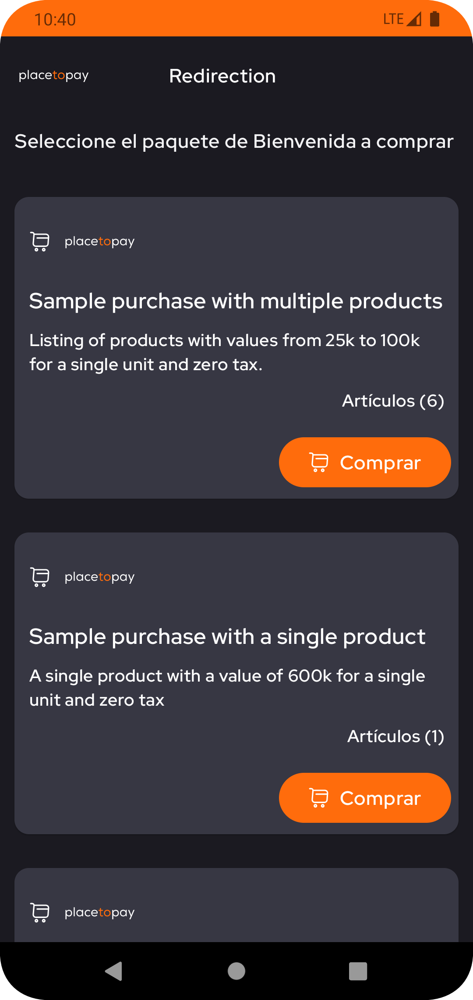
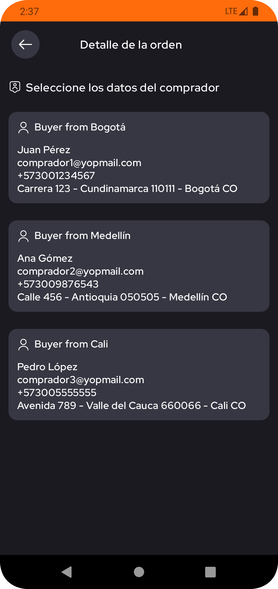
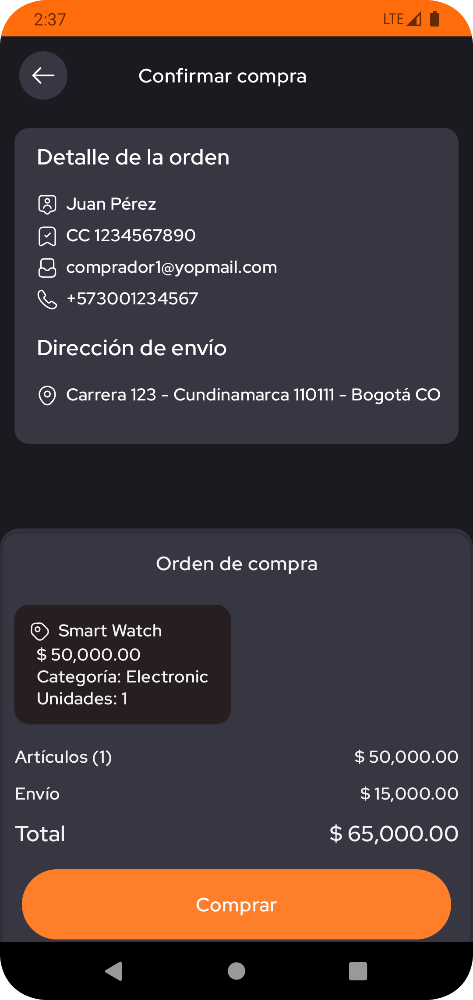
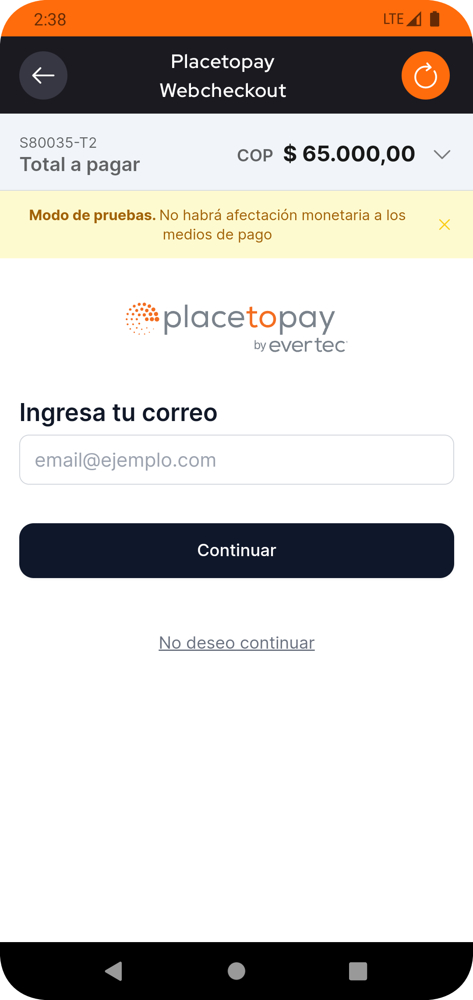
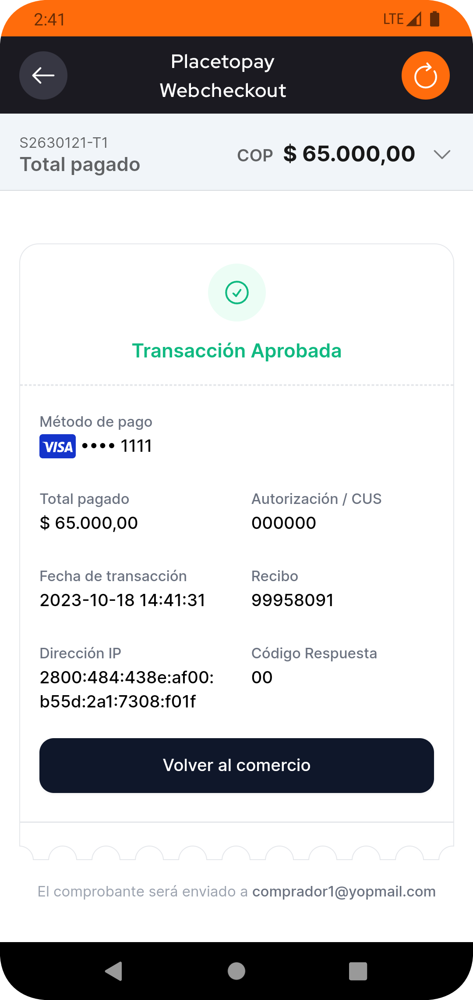
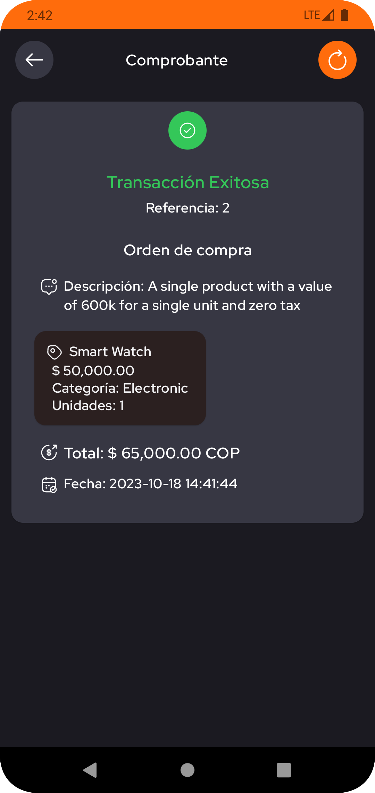

# PlacetoPay Redirection


With this example you will be able to quickly connect with the PlacetoPay Checkout Services.

In order to see more comprehensive examples of how it works, please refer to the examples and
the [docs page](https://docs.placetopay.dev/checkout)

***

## Table of Contents

### Integrating Checkout

- [Authentication](#authentication)
  - [Requirements](#requirements)
  - [How to generate your authentication](#how-to-generate-your-authentication)
- [Setup services with Retrofit](#setup-services-with-retrofit)
- [Create session](#create-session)
- [Query a session](#query-a-session)
- [Settings your WebView](#settings-your-webview)

### Sample App

- [Test your credentials](#test-your-credentials)
- [Preview](#preview)
- [Libraries](#libraries)
- [Glossary](#glossary)

### Language
- [Español](README-es.md)

***

## Authentication

The auth parameter must be sent in **all API requests** and contains the set of properties needed to verify
authentication.

### Requirements

> To integrate with Checkout you must have your `login` and `secretKey` credentials.

- `login`: Site identifier, can be considered public as it travels as plain data in API requests.
- `secretKey`: Secret key of the site, it must be private, from this data a new tranKey will be generated that will be
  sent in the requests.

> These credentials are unique to your site and should be treated securely.
> 
> Do not share your credentials in public accessible areas such as Github, client-side code or other places easily to
> third parties.

### [How to generate your authentication](https://docs.placetopay.dev/en/checkout/authentication#how-to-generate-your-authentication)

You must know and prepare the following information:

| Parameter   | Description                                                                                                                                                                |
|:------------|:---------------------------------------------------------------------------------------------------------------------------------------------------------------------------|
| `login`     | Site identifier, credential provided when starting your integration.                                                                                                       |
| `secretKey` | Site secret key, credential provided when starting your integration.                                                                                                       |
| `seed`      | This is the date the authentication was generated. Date must be in ISO 8601 format.                                                                                        |
| `nonce`     | Random string value that identifies a request as unique. It is generated and used to create `tranKey` without base64 encoding. When sending it, it must be base64 encoded. |
| `tranKey`   | Generated on every request programmatically. It is generated with the following formulas Base64(SHA-256(nonce + seed + secretKey)).                                        |

> For this example, a Colombia environment is being used.
> For more information,
> see
> the [directory of environments](https://docs.placetopay.dev/en/checkout/test-your-integration#directory-of-environments)

***

The `CheckoutAuth` example class is used as a request parameter in authentication operations.
The class includes private methods for cryptographic computations, ensuring the security and confidentiality of the
authentication.

``` kotlin
data class CheckoutAuth(
    val login: String,
    @Expose(serialize = false)
    private val secretKey: String
) {
    private var nonce: String
    private var seed: String
    private var tranKey: String

    init {
        requireNotNull(login.isNotEmpty()) { "No login provided on authentication" }
        requireNotNull(secretKey.isNotEmpty()) { "No tranKey provided on authentication" }
        val nonceTemp = secureRandom()
        seed = dateInISO()
        tranKey = toBase64(toSHA256(nonceTemp + seed + secretKey))
        nonce = toBase64(nonceTemp.encodeToByteArray())
    }

    private fun secureRandom(): String = BigInteger(130, SecureRandom()).toString()

    private fun dateInISO(): String =
        SimpleDateFormat("yyyy-MM-dd'T'HH:mmZ", Locale.getDefault()).apply {
            timeZone = TimeZone.getTimeZone("America/Bogota")
        }.format(Calendar.getInstance().time)

    private fun toBase64(input: ByteArray): String {
        val encodedBytes: ByteArray =
            if (Build.VERSION.SDK_INT >= Build.VERSION_CODES.O)
                Base64.getEncoder().encode(input)
            else android.util.Base64.encode(input, android.util.Base64.NO_WRAP)

        return String(encodedBytes)
    }

    private fun toSHA256(input: String): ByteArray =
        MessageDigest.getInstance("SHA-256").digest(input.toByteArray())
}
```

`CheckoutAuth` as a parameter in the request body in JSON.

``` json
{
    "login": "c51ce410c124a10e0db5e4b97fc2af39",
    "tranKey": "VQOcRcVH2DfL6Y4B4SaK6yhoH/VOUveZ3xT16OQnvxE=",
    "nonce": "NjE0OWVkODgwYjNhNw==",
    "seed": "2023-10-17T16:22-0500"
}
```

> Frequent errors, see the [possible errors](https://docs.placetopay.dev/en/checkout/authentication#possible-errors)

***

### Setup services with Retrofit

Create the service interface with Retrofit for the [`Create Session`](#create-session)
and [`Query Session`](#query-a-session) endpoints.

> The Retrofit instance must have as `baseUrl` the [environment](https://docs.placetopay.dev/en/checkout/test-your-integration#directory-of-environments) according to the app version.
> 
> Parameters with the **@Body** must contain the auth parameter of type `CheckoutAuth` or the data class responsible for authentication.

``` kotlin
interface CheckoutService {

    @POST("/api/session")
    suspend fun createSession(
        @Body payment: CheckoutPaymentRequest,
    ): Response<CheckoutPaymentResponse>

    @POST("/api/session/{requestId}")
    suspend fun informationSession(
        @Path("requestId") requestId: String,
        @Body payment: CheckoutInformationRequest,
    ): Response<CheckoutInformationResponse>
    
    ...
}
```

***

### [Create session](https://docs.placetopay.dev/en/checkout/api-reference/session#create-a-session)

Creating a new payment request to obtain a session payment Url.

Just provide the information of the payment needed and you will get a process url if its successful, for this example we
are using the **Basic Information** that needs to be provided, to see the full structure refer to
the [docs page](https://docs.placetopay.dev/en/checkout/create-session).

The `CheckoutPaymentRequest` example class is used as a body request. The class includes the payment, buyer, shipping
and other information.

``` kotlin
data class CheckoutPaymentRequest(
    val auth: CheckoutAuth,
    val buyer: CheckoutBuyer? = null,
    val cancelUrl: String,
    val captureAddress: Boolean = false,
    val expiration: String,
    val fields: List<CheckoutField>? = null,
    val locale: String,
    val noBuyerFill: Boolean = false,
    val payment: CheckoutPayment,
    val returnUrl: String,
    val ipAddress: String,
    val skipResult: Boolean = false,
    val userAgent: String
)
```

`CheckoutPaymentRequest` as a request body in JSON.

> See [full basic payment](examples/basic_payment_reques.json)

``` json
{
  "auth": {
    "login": "c51ce410c124a10e0db5e4b97fc2af39",
    ...
  },
  "expiration": "2023-10-17T23:13-0500",
  "locale": "es_CO",
  "payment": {
    "amount": {
      "currency": "COP",
      "details": [
        {
          "amount": 150000.0,
          "kind": "subtotal"
        },
        ...
      ],
      "total": 165000.0,
      ...
    },
    "buyer": {
      ...
    },
    "items": [
      {
        "category": "Books",
        "name": "Libro antiguo",
        "price": 80000,
        "qty": 1,
        "sku": 302,
        "tax": 15200.0
      },
      ...
    ],
    "reference": "3"
  },
  "returnUrl": "redirection://receipt?return",
  "userAgent": "Mozilla/5.0 (X11; Linux x86_64) Chrome/52.0.2743.116 Safari/537.36 ...",
  ...
}
```

The `CheckoutPaymentResponse` example class is used as a response body. The class includes the status, request id
and payment Url.

``` kotlin
data class CheckoutPaymentResponse(
    val status: CheckoutStatus,
    val requestId: String,
    val processUrl: String,
)
```

`CheckoutPaymentResponse` as a response body in JSON.

``` json
{
  "status": {
    "status": "OK",
    "reason": "PC",
    "message": "La petición se ha procesado correctamente",
    "date": "2023-10-18T15:02:20-05:00"
  },
  "requestId": 2630139,
  "processUrl": "https://checkout-test.placetopay.com/spa/session/2630139/7149a8cf3..."
}
```

---

### [Query a session](https://docs.placetopay.dev/en/checkout/api-reference/session#query-a-session)

This endpoint allows you to obtain the information of the session, if there are transactions in the session, the details
of the same are shown.

The `CheckoutInformationRequest` example class is used as a body request. The class include auth information.

``` kotlin
data class CheckoutInformationRequest(
    val auth: CheckoutAuth,
)
```

`CheckoutInformationRequest` as a request body in JSON.

``` json
{
  "auth": {
    "login": "c51ce410c124a10e0db5e4b97fc2af39",
    "nonce": "NjE0OWVkODgwYjNhNw==",
    "seed": "2023-10-17T17:13-0500",
    "tranKey": "VQOcRcVH2DfL6Y4B4SaK6yhoH/VOUveZ3xT16OQnvxE="
  }
}
```

The `CheckoutInformationResponse` example class is used as a response body. The class includes the status, request id
and payment information.

``` kotlin
data class CheckoutInformationResponse(
    val status: CheckoutStatus,
    val requestId: String,
    val request: CheckoutPaymentRequest,
    ...
)
```

`CheckoutInformationResponse` as a response body in JSON.

> See [full information response](examples/information_response.json)

``` json
{
  "requestId": 2630139,
  "status": {
    "status": "APPROVED",
    "reason": "00",
    "message": "La petición ha sido aprobada exitosamente",
    "date": "2023-10-18T15:02:42-05:00"
  },
  "request": {
    "locale": "es_CO",
    "payer": {
      "document": "1040035001",
      ...
    },
    "payment": {
      "reference": "2",
      "amount": {
        "details": [
          {
            "kind": "shipping",
            "amount": 15000
          },
          ...
        ],
        "currency": "COP",
        "total": 65000
      },
      "items": [
        ...
      ],
      ...
    },
    "fields": [
      {
        "keyword": "_processUrl_",
        "value": "https://checkout-test.placetopay.com/spa/session/2630139/7149...",
        "displayOn": "none"
      },
      ...
    ],
    "returnUrl": "redirection://receipt?return",
    "userAgent": "Mozilla/5.0 (X11; Linux x86_64) Chrome/52.0.2743.116 Safari/537.36 ...",
    ...
  },
  "payment": [
    {
      "amount": {
        ...
      },
      "status": {
        "date": "2023-10-18T15:02:39-05:00",
        "status": "APPROVED",
        ...
      },
      "issuerName": "JPMORGAN CHASE BANK, N.A.",
      "paymentMethod": "visa",
      "processorFields": [
        {
          "value": "012988341",
          "keyword": "merchantCode",
          "displayOn": "none"
        },
        ...
      ],
      "paymentMethodName": "Visa",
      ...
    }
  ],
  "subscription": null
}
```

---

### Settings your WebView

These settings help optimize and customize the browsing experience within the Android application's WebView.

> WebView configuration for optimal Web Checkout display

``` kotlin
AndroidView(factory = {
        WebView(it).apply {
            settings.javaScriptEnabled = true
            settings.domStorageEnabled = true
            clearCache(true)
            webChromeClient = WebChromeClient()
            webViewClient = object : WebViewClient() {
                ...
            }
            loadUrl(...)
        }
    }, update = {
        it.loadUrl(...)
        ...
    })
    
```

| Property                              | Description                                                                                    |
|:--------------------------------------|:-----------------------------------------------------------------------------------------------|
| `JavaScriptEnabled`                   | Enables the execution of JavaScript on the loading web page.                                   |
| `DomStorageEnabled`                   | Enables web pages to store data locally, which can improve speed and performance.              |
| `ClearCache`                          | Clears the WebView cache before loading a new URL.                                             |
| `WebChromeClient` and `WebViewClient` | Configure the WebView's behavior for events such as URL loading and interaction with the page. |

---

## Test your credentials

- Clone this repository on your local machine.

```
git clone https://github.com/placetopay-org/checkout-android.git
```

- Open project in Android Studio.
- Configure your `login`, `secretKey` and `urlEnvironment` credentials in `/app/src/debug/assets/private.properties`.
- Build and run.

---

## Preview








---

### Libraries

| Library         | Version                                                |
|:----------------|:-------------------------------------------------------|
| Compose BOM     | `androidx.compose:compose-bom:2023.03.00`              |
| View Model      | `androidx.lifecycle:lifecycle-viewmodel-compose:2.5.1` |
| Glide           | `com.github.bumptech.glide:compose:1.0.0-alpha.5`      |
| Dagger Hilt     | `com.google.dagger:hilt-android:2.44.2`                |
| Hilt Navigation | `androidx.hilt:hilt-navigation-compose:1.0.0`          |
| Retrofit        | `com.squareup.retrofit2:retrofit:2.9.0`                |
| Gson Converter  | `com.squareup.retrofit2:converter-gson:2.9.0`          |
| Chucker         | `com.github.chuckerteam.chucker:library:4.0.0`         |

---

### Glossary

| Name        | Description                                                                                                           |
|:------------|:----------------------------------------------------------------------------------------------------------------------|
| `login`     | Site identifier, it can be considered public because it travels as plain data in API requests.                        |
| `secretKey` | Secret key of the site, it must be private, from this data a new `tranKey` will be generated and sent in the request. |
| `tranKey`   | Generated on every request programmatically.                                                                          |
| `nonce`     | Arbitrary value that identifies a request as unique.                                                                  |
| `seed`      | This is the date the authentication was generated.                                                                    |
| `baseUrl`   | [Environment URL](https://docs.placetopay.dev/en/checkout/test-your-integration#directory-of-environments).           |